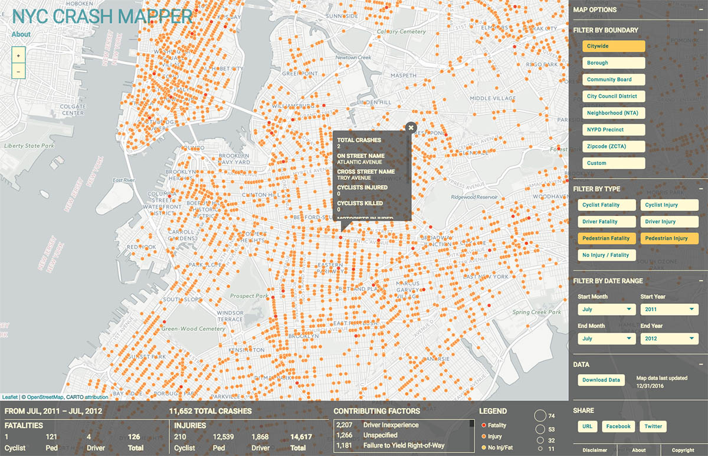

# NYC CRASH MAPPER


Web application that geographically maps, filters, aggregates, & provides trends of NYC automobile collision data that is published by the NYPD.

## Install
Requires NodeJS@^6 and NPM to be accessible globally. It is recommended to use Node
Version Manager (`nvm`) to ensure compatibility with Node and dependencies in `project.json`.

Assuming [`nvm`](https://github.com/creationix/nvm) is available globally, do:

```
nvm use && npm install
```

## Develop

```
npm run serve
```

## Build

```
npm run build
```

## Deploy
### To Github Pages
Be sure this folder is under version control using `git` and is pointing to a remote repository on Github.

Enable permissions to read/execute the `deploy_gh_pages.sh` bash script:

```
chmod u+rx deploy_gh_pages.sh
```

Then do:

```
npm run deploy:gh-pages
```

That will run `npm build` and execute the bash script, creating a Github Pages site with the content of the `dist` directory.
